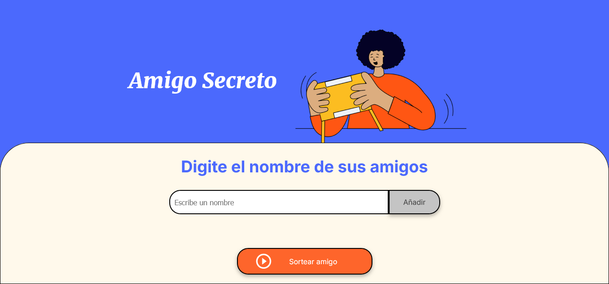
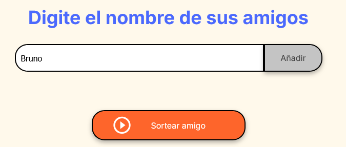
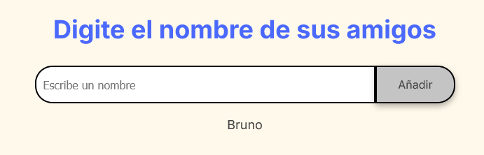
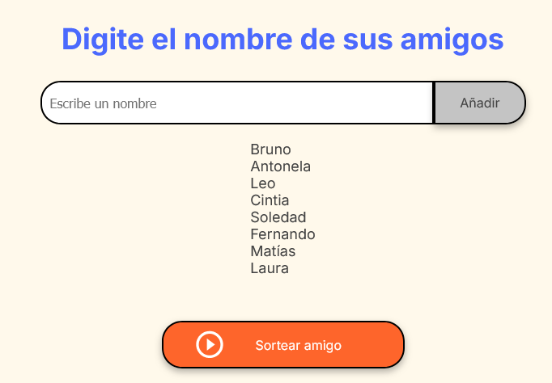
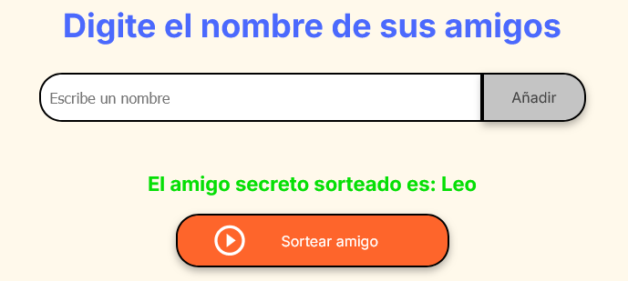

  <h1>Amigo secreto</h1>

## Índice

*[Tecnologías y herramientas utilizadas](#tecnologías-y-herramientas-utilizadas-)

*[Descripción](#descripción)

*[Funcionalidades](#fucionalidades)

## Tecnologías y herramientas utilizadas 💻:

 
 
 

[Volver al índice](#índice)

## Descripción
En este desafío, se desarrolló una aplicación que permite a los usuarios ingresar nombres de amigos en una lista para luego realizar un sorteo aleatorio y determinar quién es el "amigo secreto".

El usuario deberá agregar nombres mediante un campo de texto y un botón "Añadir". Los nombres ingresados se mostrarán en una lista visible en la página, y al finalizar, un botón "Sortear Amigo" seleccionará uno de los nombres de forma aleatoria, mostrando el resultado en pantalla.

[Volver al índice](#índice)

## Fucionalidades:
- **` Agregar nombres `**: Los usuarios escribirán el nombre de un amigo en un campo de texto y lo agregarán a una lista visible al hacer clic en "Añadir".

- **` Validar entrada `**: Si el campo de texto está vacío, el programa mostrará una alerta pidiendo un nombre válido.

- **` Visualizar la lista `**: Los nombres ingresados aparecerán en una lista debajo del campo de entrada.

- **` Sorteo aleatorio `**: Al hacer clic en el botón "Sortear Amigo", se seleccionará aleatoriamente un nombre de la lista y se mostrará en la página.

[Volver al índice](#índice)